# Shopping Cart App

## Shopping Cart List

  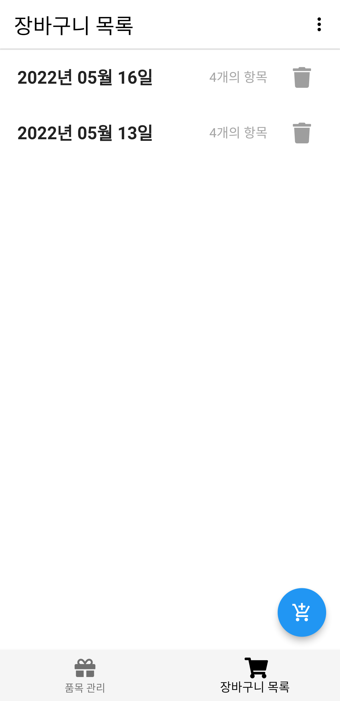
  
  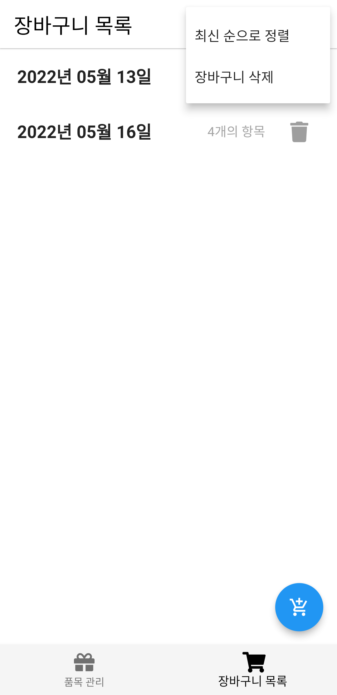

You can tap shopping cart to load it or tap floating action button to add new one.

There is two popup menu items:
- Sort shopping carts in old/latest order
- Delete shopping carts

#### Delete Shopping carts

  

### Add new shopping cart / Load shopping cart

  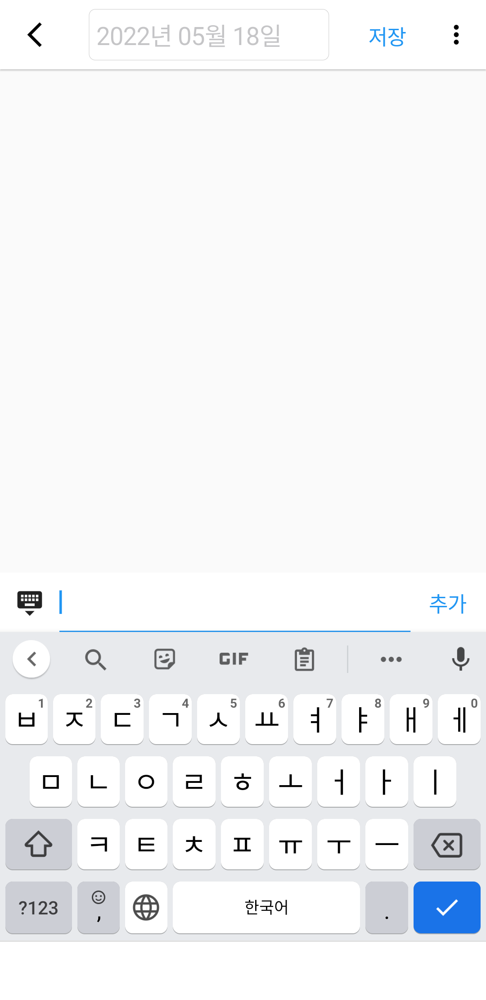
  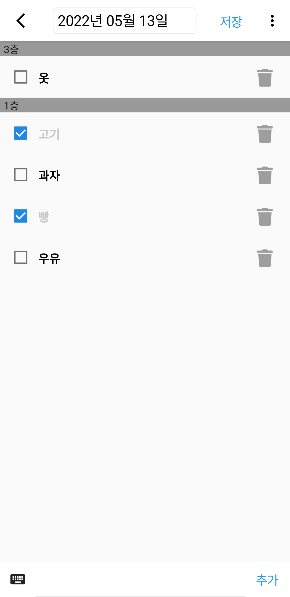
  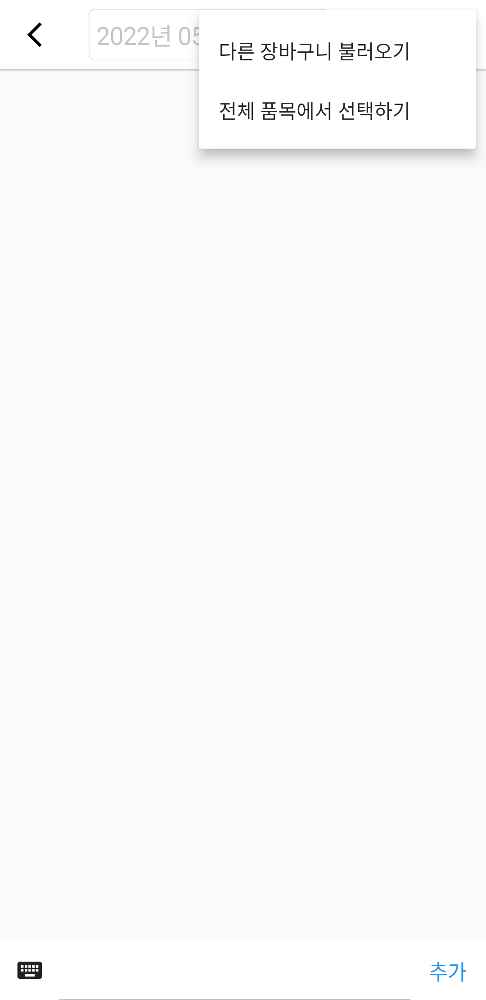

If the title is unspecified, it will automatically set to today's date.  
You should click 'Save' button to save changes.  

There is two popup menu items:  
- Load other shopping cart (left)  
- Select items from entire item list (right)  

  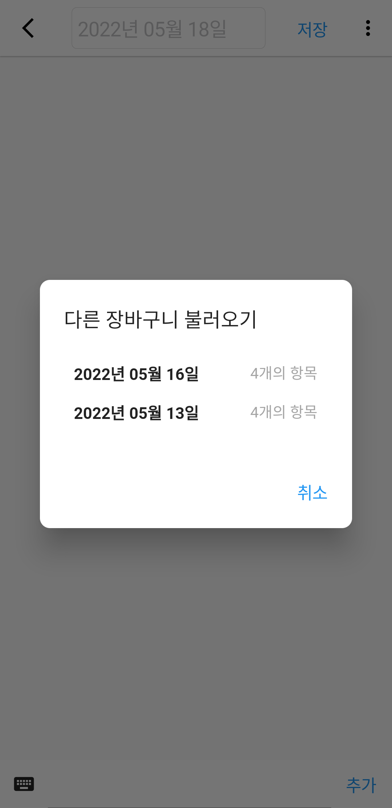
  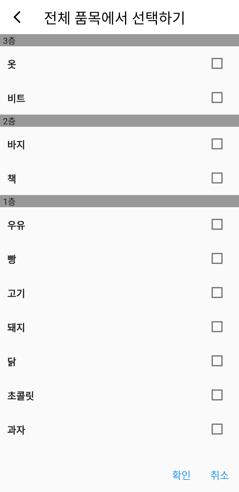

## Item Management

  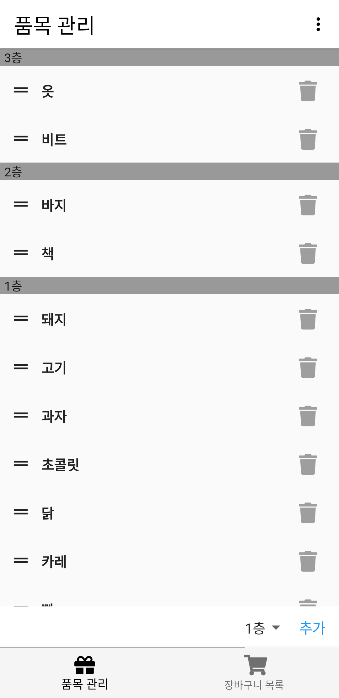
  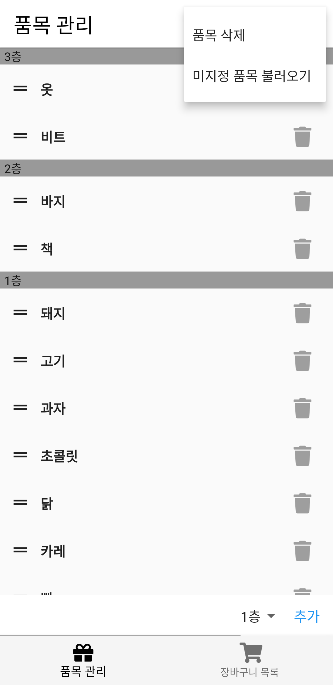

You can drag handle icons to order items. The order is automatically saved and reflected in shopping carts.  
You can click trash can icons to delete items.  
You can also use popup menu item to delete items.  

There is two popup menu items:
- Delete items
- Load unspecified items from shopping carts

### Delete items

  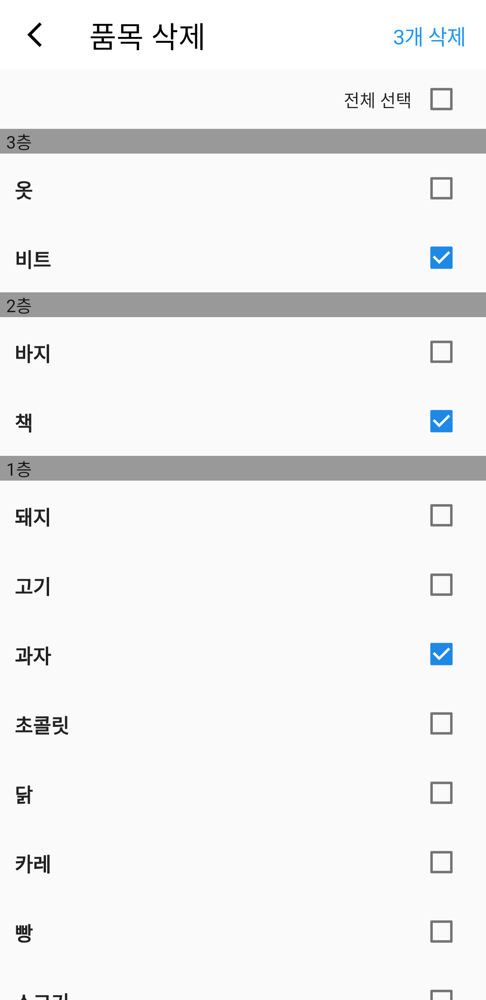

### Load unspecified items from shopping carts

  
  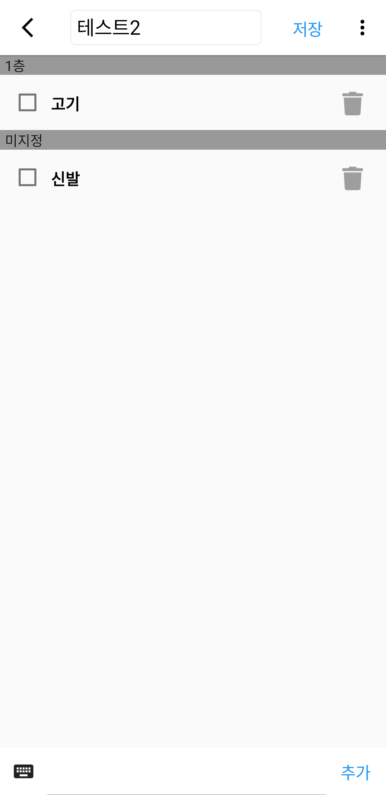
  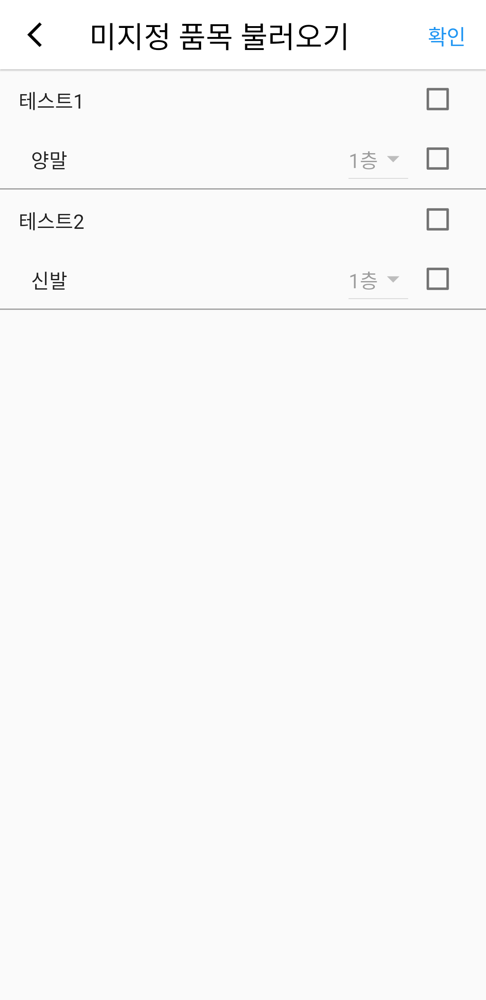
  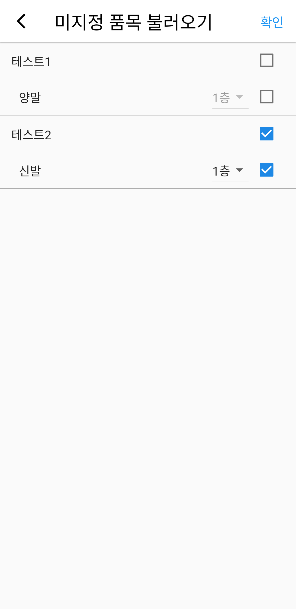

Unspecified items from all shopping carts that previously made is loaded on screen.  
