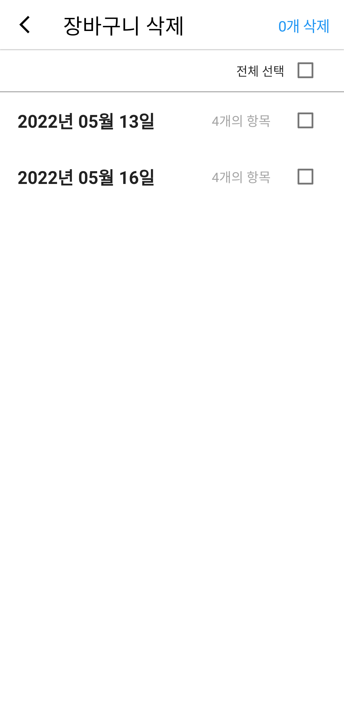

# Shopping Cart App

## Shopping Cart List

  
  
  

There is two popup menu items:
- Sort shopping carts in old/latest order
- Delete shopping carts

#### Delete Shopping carts

  

### Add new shopping cart / Load shopping cart

  
  
  

There is two popup menu items:
- Load other shopping cart (left)
- Select items from entire item list (right)

  
  

## Item Management

  
  

There is two popup menu items:
- Delete items
- Load unspecified items from shopping carts

### Delete items

  

### Load unspecified items from shopping carts

  
  
  
  

Unspecified items from all shopping carts that previously made is loaded on screen. 
